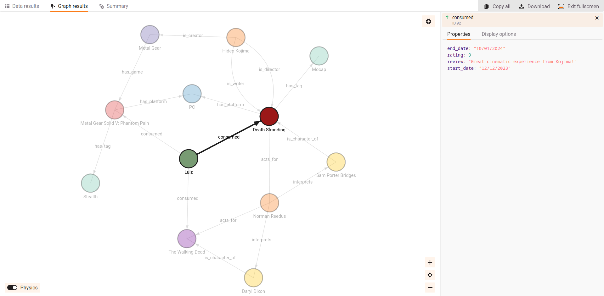

# graph-databases

Some API implementations for graph-based databases (GBDs) for testing and prototyping.

## Quick summary of the current state of graph databases

- There is no standardization yet, multiple query languages exists. Neo4j uses Cypher (declarative), JanusGraph uses Gremlim (declarative), Dgraph uses DQL (basically just GraphQL), SPARQL is used in RDF-based graphs and many more exist.
- A standard called [GQL](https://neo4j.com/blog/gql-international-standard/) is being developed, and is based on [openCypher](https://opencypher.org/).

# Some considerations

- Neo4j is the most used GBD.
- JanusGraph's ecosystem isn't very straightfoward, needing a good deal of configuration to properly work.
- Memgraph appears to be much, much faster than Neo4j in their [benchmark](https://memgraph.com/benchmark).

## Neo4j

## JanusGraph

## Memgraph

